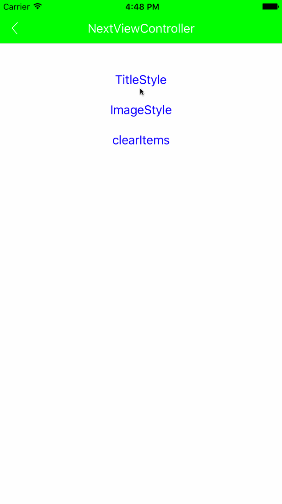

# SSLNavigationBar
A simple custom navigation bar, Create SLBarButtonItem just like create UIBarButtonItem style, convenient to extend the Navigationbar.


[Click here to visit the Objective-C version.](https://github.com/smilelu/SLNavigationBar).



## Example

To run the example project, clone the repo, and run `pod install` from the Example directory first.

###SLBarButtonItem
Add a barBottunItem: 
```swift
let leftItem : SLBarButtonItem = SLBarButtonItem(image: UIImage(named: "titlebar_user"), target: self, action: #selector(userClick(_:)))
self.naviBar.leftItem = leftItem
```

Add a few of barBottonItems:
```swift
let rightItem1 = SLBarButtonItem(title: "编辑", target: self, action: #selector(rightItemClick(_:)))
let rightItem2 = SLBarButtonItem(image: UIImage(named: "titlebar_scan"), target: self, action: #selector(rightItemClick(_:)))
self.naviBar.rightItems = [rightItem1, rightItem2]
```

###SLBaseViewController
The ViewController which is Inheritance from SLBaseViewController, can override method initNaviBar.You can set default SLNavigationBar title use the following method:
```swift
self.title = "SLNavigationBar Demo";
```

## Requirements

## Installation

SSLNavigationBar is available through [CocoaPods](http://cocoapods.org). To install
it, simply add the following line to your Podfile:

```ruby
pod "SSLNavigationBar"
```

## Author

Smilelu, hmilyt@foxmail.com

## License

SSLNavigationBar is available under the MIT license. See the LICENSE file for more info.
